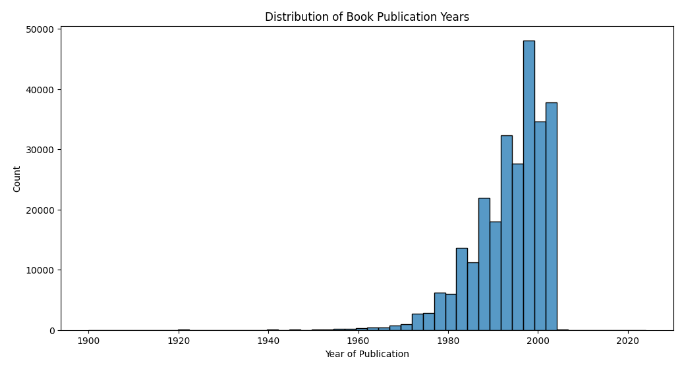
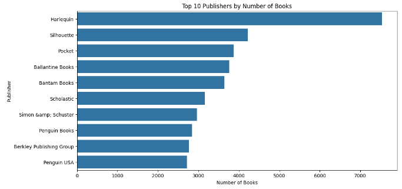
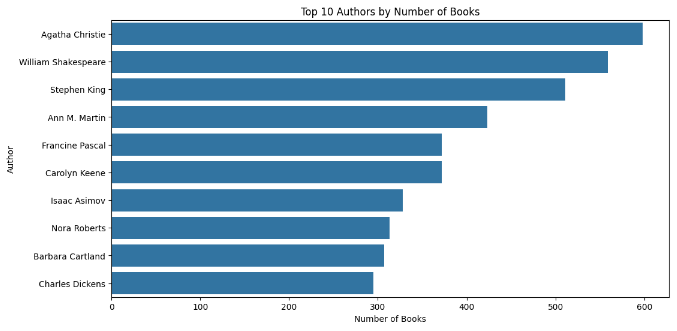
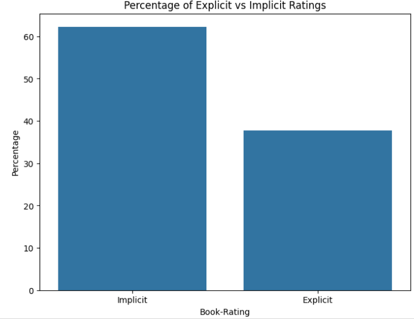
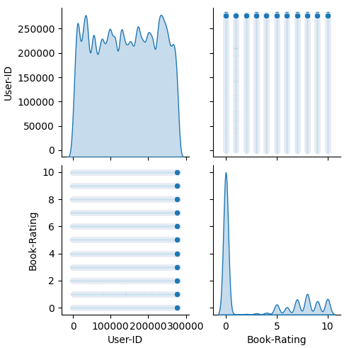
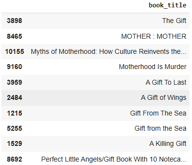
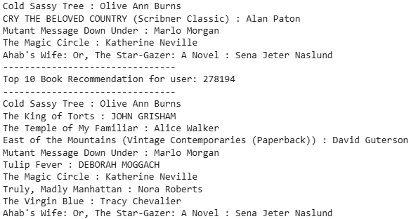

# Laporan Proyek Machine Learning - Monica Mamondol
Ini adalah proyek akhir sistem rekomendasi. Proyek ini membangun model berbasis _content based filtering_ dan _collaborative filtering_ yang dapat menentukan top-N rekomendasi buku.
## Project Overview

Dalam era digital yang ditandai oleh pertumbuhan pesat informasi dan ragam produk, termasuk buku, pengguna sering kali dihadapkan pada kesulitan dalam menemukan buku yang sesuai dengan minat dan kebutuhannya. Banyaknya pilihan buku yang tersedia di perpustakaan, toko buku daring, maupun platform digital membuat proses pencarian buku menjadi semakin kompleks dan memakan waktu [[1](https://dspace.uii.ac.id/bitstream/handle/123456789/35942/17523144%20Muhammad%20Rizqi%20Az%20Zayyad.pdf?sequence=1)]. Sistem rekomendasi hadir sebagai solusi untuk membantu pengguna dalam memilih buku yang relevan dan sesuai dengan preferensi mereka. Sistem ini merupakan perangkat lunak yang dirancang untuk memberikan saran atau rekomendasi item tertentu-dalam hal ini buku-berdasarkan data preferensi, perilaku, atau riwayat interaksi pengguna sebelumnya [[2](https://bisa.ai/portofolio/detail/MzM4OQ)]. Dengan adanya sistem rekomendasi, pengguna dapat lebih mudah menemukan buku-buku yang mungkin belum mereka ketahui namun berpotensi sesuai dengan minat mereka, sehingga meningkatkan kepuasan dan pengalaman membaca [[3](https://repository.unissula.ac.id/9839/6/BAB%20I_1.pdf)].

Mengapa Proyek ini Penting Untuk Diselesaikan?

- Membantu Pembaca : Memudahkan pengguna dalam menemukan buku yang sesuai dengan minat mereka tanpa harus mencari secara manual.
- Meningkatkan Engagement Platform : Jika diterapkan di toko buku online atau perpustakaan digital, sistem rekomendasi dapat meningkatkan interaksi pengguna.
- Memanfaatkan Data Secara Optimal : Dengan menganalisis data rating, review, dan preferensi pengguna, sistem dapat memberikan insight yang bermanfaat bagi penerbit dan penulis.
- Dapat Dikembangkan Lebih Lanjut : Sistem ini dapat diintegrasikan dengan aplikasi lain seperti e-learning, perpustakaan digital, atau e-commerce buku.

## Business Understanding
Pengembangan sistem rekomendasi buku memiliki potensi besar untuk memberikan berbagai manfaat signifikan bagi para pembaca dan platform penyedia buku, baik digital maupun fisik. Sistem ini dirancang untuk menciptakan pengalaman yang lebih personal dan efisien dalam menemukan bacaan yang sesuai [[4](https://jig.rivierapublishing.id/index.php/rv/article/view/255)].

### Problem Statements
Berdasarkan latar belakang di atas, berikut ini merupakan rincian masalah yang dapat diselesaikan pada proyek ini:

- Berdasarkan data mengenai pengguna, bagaimana membuat sistem rekomendasi yang dipersonalisasi dengan teknik content-based filtering?  
- Dengan data rating yang dimiliki, bagaimana perusahaan dapat merekomendasikan buku lain yang mungkin disukai dan belum pernah dikunjungi oleh pengguna? 

### Goals
Tujuan dari proyek ini adalah:

- Menghasilkan sejumlah rekomendasi buku yang dipersonalisasi untuk pengguna dengan teknik content-based filtering.
- Menghasilkan sejumlah rekomendasi buku yang sesuai dengan preferensi pengguna dan belum pernah dikunjungi sebelumnya dengan teknik collaborative filtering.

### Solution Approach
Untuk mencapai tujuan tersebut, sistem rekomendasi ini akan menggunakan dua pendekatan utama:

- **Content-Based Filtering** Sistem ini menganalisis fitur atau konten dari item, seperti judul, deskripsi, penulis, atau kata kunci, untuk menemukan dan merekomendasikan item lain yang memiliki kemiripan dengan preferensi pengguna [[5](https://dqlab.id/content-based-filtering-dalam-algoritma-data-science)].
- **Collaborative filtering** adalah teknik dalam sistem rekomendasi yang memprediksi item yang mungkin disukai oleh pengguna berdasarkan penilaian atau preferensi pengguna lain yang memiliki kesamaan dengan pengguna tersebut. Prinsip dasarnya adalah bahwa pengguna yang memiliki preferensi serupa di masa lalu cenderung memiliki preferensi yang sama di masa depan [[6](https://kc.umn.ac.id/id/eprint/18116/7/BAB_II.pdf)]. 

## Data Understanding
### EDA - Deskripsi Variabel

| Jenis    | Keterangan                                                |
|----------|-----------------------------------------------------------|
| Title    | Book Recommendation Dataset                                      |
| Source   |[Kaggle](https://www.kaggle.com/datasets/arashnic/book-recommendation-dataset/data)                                                  |
| Maintainer | [Möbius](https://www.kaggle.com/arashnic)                                                   |
| License  | CC0: Public Domain      |
| Visibility | Publik                                                  |
| Tags     | Online Communities, Literature, Art, Recommender Systems, Culture and Humanities |
| Usability | 10.00                                                     |

**Berikut informasi pada dataset** :
 - Datasets berupa file csv (Comma-Seperated Values).
 - Dataset berupa 3 buah file CSV yaitu:
   * Books.csv
   * Ratings.csv
   * Users.csv

File `Books.csv` :

-  Dataset memiliki 271360 sample dengan 8 fitur.
 - Dataset memiliki 8 fitur `object`.
 - Terdapat *Missing value* pada fitur  `Book-Author sebanyak 2, Publisher sebanyak 2 dan Image-URL-L sebanyak 3`.
 - Tidak ada data yang duplikat.

File `Ratings.csv` :

- Dataset memiliki 1149780 sample dengan 3 fitur.
- Dataset memiliki 2 fitur `int64` dan 1 fitur `object`.
- Tidak terdapat *Missing value*.
- Tidak ada data yang duplikat.

File `Users.csv` :

- Dataset memiliki 278858 sample dengan 3 fitur.
- Dataset memiliki 1 fitur `float64`, 1 fitur `int64` dan 1 fitur `object`.
- Terdapat *Missing value* pada fitur `Age sebanyak 110762`.
- Tidak ada data yang duplikat. 

### Variable - variable pada dataset 
Kolom datasets books memiliki informasi berikut:
* **`ISBN`:** Nomor identifikasi unik untuk setiap buku (standar internasional).
* **`Book-Title`:** Judul lengkap buku.
* **`Book-Author`:** Nama penulis buku.
* **`Year-Of-Publication`:** Tahun terbit buku.
* **`Publisher`:** Nama penerbit buku.
* **`Image-URL-S`:** URL gambar sampul buku dengan ukuran (Small).
* **`Image-URL-M`:** URL gambar sampul buku dengan ukuran (Medium).
* **`Image-URL-L`:** URL gambar sampul buku dengan ukuran (Large).

Kolom datasets ratings memiliki informasi berikut:
* **`User-ID`:** Identifikasi unik untuk setiap pengguna yang memberikan rating.
* **`ISBN`:** Nomor identifikasi buku yang dirating, terkait dengan dataset books.
* **`Book-Rating`:** Nilai rating yang diberikan pengguna untuk buku tertentu.

Kolom datasets users memiliki informasi berikut:
* **`User-ID`:** Identifier unik untuk setiap pengguna, sama dengan kolom User-ID di dataset ratings.
* **`Location`:** Lokasi pengguna dalam format "kota, negara bagian, negara".
* **`Age`:** Usia pengguna dalam tahun.

Pada model kali ini dataset yang digunakan adalah file `Books.csv`, dan `Ratings.csv`.

### EDA - Univariate Analysis

Gambar 1. Analisis Univariat
- Dominasi era 1980–2005: Sebagian besar buku dalam dataset diterbitkan setelah tahun 1980, dengan puncaknya sekitar tahun 2000. 
- Jumlah buku meningkat drastis sejak tahun 1980, artinya data buku yang tersedia lebih lengkap atau penerbitan buku memang meningkat di era itu.

Gambar 2. Analisis Univariat
- Harlequin adalah penerbit paling produktif dalam dataset ini, dengan lebih dari 7.000 buku. Ini menunjukkan Harlequin mendominasi koleksi.

Gambar 3. Analisis Univariat
- Agatha Christie menempati peringkat pertama dengan hampir 600 buku. Ini sangat mungkin karena banyak edisi, terjemahan, atau publikasi ulang karya-karyanya.

Gambar 4. Analisis Univariat
- Mayoritas data rating berasal dari perilaku implisit. Ini umum terjadi karena pengguna sering tidak memberi rating secara manual, tetapi interaksi mereka tetap bernilai.

### EDA - Multivariate Analysis

Gambar 5. Analisis Multivariat
- User-ID (kiri atas) :  Distribusi user cukup merata, artinya tidak ada dominasi dari user tertentu. Ini mengindikasikan banyak user aktif memberikan rating, tidak hanya segelintir.
- Book-Rating (kanan bawah) : Terdapat puncak sangat tinggi di nilai 0, menunjukkan banyak rating 0 — kemungkinan ini adalah rating implisit (tanpa penilaian sebenarnya). Rating lainnya (1–10) tersebar relatif merata, dengan sedikit lonjakan di nilai tinggi (8, 9, 10).
- Scatter Plot antara User-ID dan Book-Rating (bagian luar diagonal) etiap user dapat memberikan rating dari 0 sampai 10. 
- Tidak terlihat hubungan korelasi kuat antara User-ID dan Book-Rating (memang seharusnya tidak ada).

## Data Preparation (Content Based Filtering)

Tahap data preparation dilakukan agar data siap digunakan untuk proses modeling machine learning. Tanpa persiapan yang baik, model cenderung tidak akurat atau tidak stabil karena adanya masalah seperti missing values, ketidakseimbangan data, atau skala data yang berbeda-beda.

| No | Langkah                                           | Tujuan / Alasan                                                                                                                                   |
| -- | ------------------------------------------------- | ------------------------------------------------------------------------------------------------------------------------------------------------- |
| 1  | Rename Kolom pada Dataset                         | Mengubah nama kolom agar konsisten dan sesuai dengan konvensi penamaan Python (snake\_case).                                                      |
| 2  | Sampling Dataset                                  | Mengambil sebagian data dari dataset besar untuk mempercepat eksplorasi dan pemodelan awal.                                                       |
| 3  | Menghapus Data yang Mengandung Nilai Kosong (NaN) | Menghapus baris yang memiliki nilai kosong menggunakan `dropna()` untuk mencegah error atau bias.                                                 |
| 4  | Mendeteksi dan Menghapus Duplikat                 | Menggunakan `duplicated().sum()` untuk mendeteksi dan menghapus data yang duplikat.                                                               |
| 5  | Mengekstrak Kolom Menjadi List                    | Mengubah kolom tertentu menjadi list untuk mempermudah manipulasi dan pencocokan data (misalnya ISBN atau judul buku).                            |
| 6  | Membuat Dictionary dari List                      | Menghubungkan ISBN dengan informasi detail buku seperti judul, penulis, dan tahun terbit.                                                         |
| 7  | TF-IDF Vectorization                              | Mengubah teks (judul atau metadata buku) menjadi representasi numerik berbobot menggunakan TF-IDF, untuk menangkap pentingnya kata dalam konteks. |
| 8  | Cosine Similarity Calculation                     | Mengukur kemiripan antar buku berdasarkan vektor TF-IDF untuk digunakan dalam sistem rekomendasi.                                                 |

## Data Preparation (Collaborative Filtering)

| No | Langkah                              | Tujuan / Alasan                                                                  |
| -- | ------------------------------------ | -------------------------------------------------------------------------------- |
| 1  | Encoding ID (Label Encoding)         | Mengubah ID user dan ISBN menjadi angka untuk dapat diproses oleh model.         |
| 2  | Random Sampling (Shuffling) | Mengacak data agar distribusi latih dan validasi merata.  |
| 3  | Normalisasi Rating (Min-Max Scaling)         | Menstabilkan pelatihan model dan memastikan output berada dalam range \[0, 1].                         |
| 4  | Split Dataset (70%-30%)              | Membagi data menjadi data latih dan validasi untuk evaluasi model yang objektif. |
| 5  | Konversi ke Array (Numpy)            | Mengoptimalkan proses komputasi dan kompatibilitas dengan TensorFlow/Keras.      |

## Modeling
- Sistem rekomendasi ini dibangun untuk membantu pengguna menemukan buku yang relevan berdasarkan dua pendekatan: 
-- `Content-Based Filtering` : Rekomendasi berdasarkan kesamaan konten buku (judul).
-- `Collaborative Filtering` : Rekomendasi berdasarkan preferensi pengguna lain. 

1. **Solusi 1: Content-Based Filtering**
- Menggunakan TF-IDF Vectorizer untuk mengubah judul buku menjadi vektor numerik.
- output matriks TF-IDF: `(10000, 11486)  # 10.000 buku dengan 11.486 fitur kata unik`. 
- Cosine Similarity digunakan untuk menghitung kemiripan antar buku.
- similarity matrix: `array([[1.0, 0.0, 0.0, ...],
       [0.0, 1.0, 0.0, ...],
       ...])`
- Fungsi `get_recommendations()` menghasilkan 10 buku teratas dengan judul mirip. 
- rekomendasi untuk "Cradle and All":

- `Kelebihan` : Tidak memerlukan data rating, rekomendasi spesifik berdasarkan konten buku.
- `Kekurangan` : Tidak mempertimbangkan preferensi pengguna, Terbatas pada kesamaan kata dalam judul.

2. **Solusi 2: Collaborative Filtering**
- Menggunakan RecommenderNet (Custom Keras Model) dengan: Embedding layer untuk user dan buku. Dot product untuk memprediksi rating. 
`class RecommenderNet(tf.keras.Model):
    def __init__(self, num_users, num_book, embedding_size):
        self.user_embedding = layers.Embedding(num_users, embedding_size)
        self.book_embedding = layers.Embedding(num_book, embedding_size)
        ...`
- Loss: Binary Crossentropy.
- Optimizer: Adam.
- Metrik: RMSE.
- Hasil pelatihan: `Epoch 20/20 - RMSE: 0.2290 (train), 0.3481 (val)`
- Prediksi rating untuk buku yang belum dibaca oleh user.
- output untuk user 278194:

## Evaluation
Metrik Evaluasi yang Digunakan :
- `Content-Based Filtering` : Precision@K dan Recall@K
- `Collaborative Filtering` : Root Mean Squared Error (RMSE)

A. **Content-Based Filtering (Precision@5 dan Recall@5)**
Hasil: 
- Precision@5 = 0.40: 2 dari 5 rekomendasi relevan.
- Recall@5 = 0.67: 2 dari 3 item relevan terdeteksi.

Formula:
- Precision@K:

- Recall@K:

Interpretasi:

- Precision: Sistem cukup selektif (40% rekomendasi tepat).
- Recall: Sistem mampu menangkap 67% preferensi pengguna, tetapi masih ada 1 item relevan yang terlewat.

B. **Collaborative Filtering (RMSE)**

Grafik RMSE:

- Training RMSE: Menurun secara stabil dari epoch awal ke akhir, menunjukkan model belajar dengan baik dari data latih.
- Validation RMSE: Mengikuti tren penurunan yang serupa dengan training RMSE, tanpa overfitting (tidak ada lonjakan nilai).
- Nilai akhir RMSE stabil di sekitar 0.225–0.275, mengindikasikan error prediksi yang relatif rendah.

Formula RMSE:

Interpretasi:

- RMSE 0.225 berarti rata-rata kesalahan prediksi rating adalah ±0.225 skala (misalnya, jika rating 1–5, kesalahan ≈ 4.5–5.5%).

| Pertanyaan Evaluasi                          | Collaborative Filtering (RMSE)                                                                                                                                      | Content-Based Filtering (Precision@5 & Recall@5)                                                                                             | Kesimpulan                                                                                                                                          |
|---------------------------------------------|--------------------------------------------------------------------------------------------------------------------------------------------------------------------|----------------------------------------------------------------------------------------------------------------------------------------------|-----------------------------------------------------------------------------------------------------------------------------------------------------|
| 1. Apakah sudah menjawab problem statement? | Ya. Model berhasil memprediksi preferensi pengguna berdasarkan rating (rekomendasi buku yang belum dikunjungi). RMSE rendah (0.225) menunjukkan akurasi yang baik. | Ya. Model merekomendasikan buku mirip dengan preferensi pengguna (judul/deskripsi). Precision 40% dan Recall 67% menunjukkan relevansi.     | Kedua teknik menjawab problem statement: personalisasi (content-based) dan prediksi preferensi (collaborative).                                   |
| 2. Apakah berhasil mencapai goals?          | Ya. Goal merekomendasikan buku "belum dikunjungi" tercapai dengan error minimal (RMSE < 0.3). Generalisasi model baik (training-test konsisten).                  | Sebagian. Goal personalisasi tercapai (2/5 rekomendasi relevan), tetapi recall menunjukkan 1 item relevan terlewat. Perlu optimasi fitur.    | Collaborative unggul dalam prediksi rating, content-based perlu peningkatan cakupan rekomendasi.                                                   |
| 3. Apakah solusi berdampak bagi bisnis?     | Berdampak tinggi. Meningkatkan engagement pengguna dengan rekomendasi akurat, mengurangi churn, dan potensi meningkatkan penjualan buku.                         | Berdampak moderat. Rekomendasi personalisasi meningkatkan UX, tetapi precision rendah bisa mengurangi kepercayaan pengguna. Perlu tuning.   | Collaborative lebih berdampak langsung pada konversi, sementara content-based perlu integrasi dengan data lebih kaya (e.g., ulasan pengguna).     |

## Referensi 
1. https://dspace.uii.ac.id/bitstream/handle/123456789/35942/17523144%20Muhammad%20Rizqi%20Az%20Zayyad.pdf?sequence=1
2. https://bisa.ai/portofolio/detail/MzM4OQ
3. https://repository.unissula.ac.id/9839/6/BAB%20I_1.pdf
4. https://jig.rivierapublishing.id/index.php/rv/article/view/255
5. https://dqlab.id/content-based-filtering-dalam-algoritma-data-science
6. https://kc.umn.ac.id/id/eprint/18116/7/BAB_II.pdf
